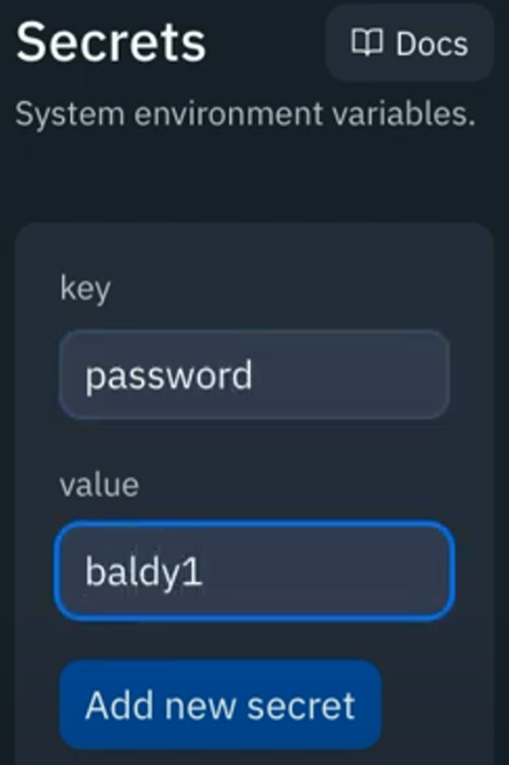

# For Your Eyes Only
**We are back to the good stuff again!**

Sometimes, we need to store information in our code that we don't want others to be able to see. Like passwords and such.

Replit repls are *public*, and we don't want other little forkers to get their hands on our passwords, do we?

👉 We can make information like this secret in our repls by selecting 'secrets' from the left hand toolbar.


👉 Secrets are a lot like **dictionaries** in that they have a key which is used to access a value.  Let's set up a password secret.



As soon as we've done that, we get a bunch of options further down our secrets menu. They use the `os` library, so we'll need to import that.

👉 Now let's use our secret to set up a very simple login system.

```python
import os

password = os.environ['password'] # Uses the os library to talk to the environment and get the secret password stored there.

userPass = input("Password > ")

if userPass == password:
  print("Well done")
else:
  print("Better luck next time")
```

The secret data **does not get copied when the repl is forked**, so it is protected from others getting a copy.


### Try it out!